# NLIMIT - Mobile Web UI Template

[](./LICENSE)

## Overview

The NLIMIT - Mobile Web UI Template is a modern and versatile template designed to create stunning user interfaces for mobile web applications. Whether you're building a progressive web app (PWA), a mobile-friendly website, or a hybrid mobile application, the NLIMIT template provides a solid foundation for creating engaging and responsive user interfaces.

### Key Features

- **_Responsive Design:_** The template is built with a mobile-first approach, ensuring that your user interface looks and functions seamlessly across a wide range of mobile devices and screen sizes.
- **_Sleek and Modern Interface:_** NLIMIT offers a sleek and modern design, featuring a clean layout, intuitive navigation, and visually appealing elements that enhance the user experience.
- **_Customizable Components:_** The template provides a rich set of UI components and elements that can be easily customized and tailored to suit your specific project requirements. From buttons and forms to navigation menus and cards, NLIMIT offers a comprehensive collection of reusable components.
- **_Built-in Mobile Interactions:_** NLIMIT incorporates mobile-friendly interactions and gestures, enabling users to navigate and interact with your web application seamlessly. Touch events, swipe gestures, and smooth animations enhance the overall user experience.
- **_Optimized Performance:_** The template follows best practices for web performance, ensuring fast loading times and smooth performance on mobile devices. It utilizes optimized code, lazy loading techniques, and image optimization to deliver a snappy and efficient user interface.
- **_Cross-Browser Compatibility:_** NLIMIT is thoroughly tested and compatible with major web browsers, including Chrome, Firefox, Safari, and Edge, ensuring consistent performance and visual fidelity across different platforms.

## Requirements

This project uses Gulp to automate tasks for building a mobile UI.

- Node.js
- Gulp

### NPM Packages

- [yargs](https://www.npmjs.com/package/yargs) - yargs helps you build interactive command line tools.
- [gulp-sass](https://www.npmjs.com/package/gulp-sass) - sass plugin for gulp.
- [gulp-clean-css](https://www.npmjs.com/package/gulp-clean-css) - gulp plugin to minify css, using clean-css.
- [gulp-if](https://www.npmjs.com/package/gulp-if) - a ternary gulp plugin, conditionally control the flow of vinyl objects.
- [gulp-sourcemaps](https://www.npmjs.com/package/gulp-sourcemaps) - write inline source maps.
- [gulp-imagemin](https://www.npmjs.com/package/gulp-imagemin) - minify PNG, JPEG, GIF and SVG images with imagemin.
- [del](https://www.npmjs.com/package/del) - delete files and folders using globs
- [webpack-stream](https://www.npmjs.com/package/webpack-stream) - run webpack as a stream to conveniently integrate with gulp.
- [babel-loader](https://www.npmjs.com/package/babel-loader) - this package allows transpiling JavaScript files using Babel and webpack.
- [gulp-uglify](https://www.npmjs.com/package/gulp-uglify) - minify JavaScript with UglifyJS3.
- [vinyl-named](https://www.npmjs.com/package/vinyl-named) - give vinyl files arbitrary chunk names.
- [gulp-zip](https://www.npmjs.com/package/gulp-zip) - ZIP compress files.
- [gulp-replace](https://www.npmjs.com/package/gulp-replace) - a string replace plugin for gulp 3.

Since all the packages are added in the `package-lock.json` file, when you run the npm install command, they will be installed automatically, so they are added here, just for reference.

## Installation

1. Clone the repository to your local machine:

```
git clone https://github.com/mnestorov/nlimit-mobile-ui.git
```

2. Navigate to the project directory:

```
cd nlimit-mobile-ui
```

2. Install the dependencies:

```
npm install --global gulp-cli
``` 
**Note 1:** You can also read the [Quick Start guide for Gulp installation](https://gulpjs.com/docs/en/getting-started/quick-start)

**Note 2:** Use latest JavaScript version in our gulpfile:

Node already supports a lot of ES2015+ features, but to avoid compatibility problems we need to **install [Babel](https://babeljs.io/docs/en/babel-register)** and rename our **_gulpfile.js_** as **_gulpfile.babel.js_**.

```
npm install --save-dev @babel/register @babel/core @babel/preset-env
```

## Usage

**This project provides several Gulp tasks to help you during development:**

- **_styles:_** Processes and minifies CSS files.
- **_images:_** Optimizes image files.
- **_fonts:_** Copies Font Awesome files to the dist/vendor/font-awesome directory.
- **_scripts:_** Transpiles and minifies JavaScript files.
- **_copy:_** Copies other files to the dist directory.
- **_clean:_** Deletes the dist and packaged directories.
- **_watch:_** Watches files for changes and runs the corresponding task.
- **_compress:_** Compresses the project files into a zip file.

You can run the tasks using the gulp command followed by the task name.  

**For example, to run the styles task, you can use:**

```
gulp styles
```

**There are also three pre-defined routines that consist of several tasks:**

- **_dev:_** Runs all tasks in parallel and then runs the watch task. Use this during development.
- **_prod:_** Cleans the dist directory and then runs all tasks in parallel. Use this to build the project for production.
- **_bundle:_** Runs the prod routine and then compresses the project files. Use this to prepare the project for distribution.

**Here is how you can use them:**

```
gulp dev
gulp prod
gulp bundle
gulp clean
```

These are all the commands we define in our `gulp.babel.js` file.

**Run the project for development with hot reload:**

```
gulp dev
``` 

or 

```
npm run dev
```

**Build the project for production:**

```
gulp bundle --prod
``` 

or 

```
npm run bundle
```

**Clean the project and remove the `dist` folder:**

```
gulp clean
```

or

```
npm run clean
```

## Screenshots

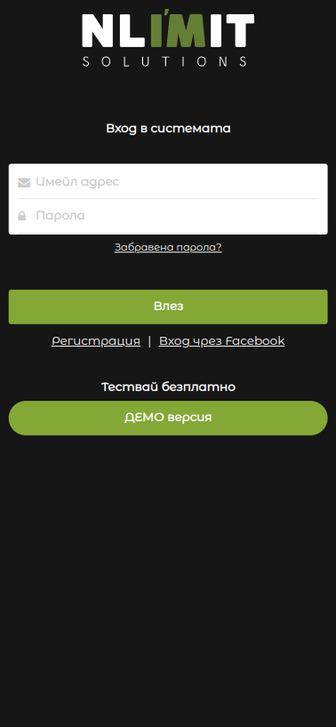
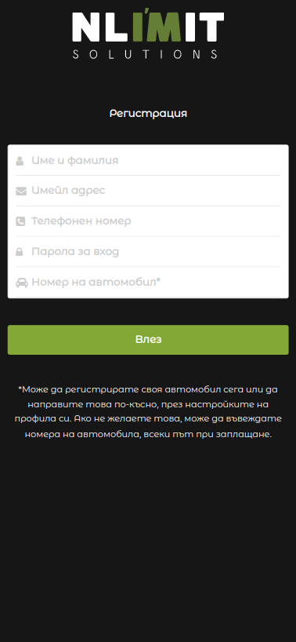
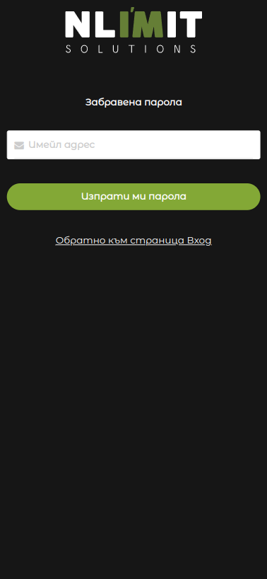
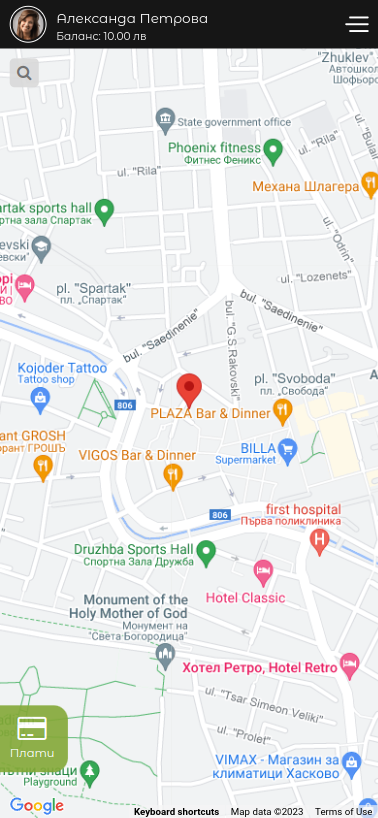
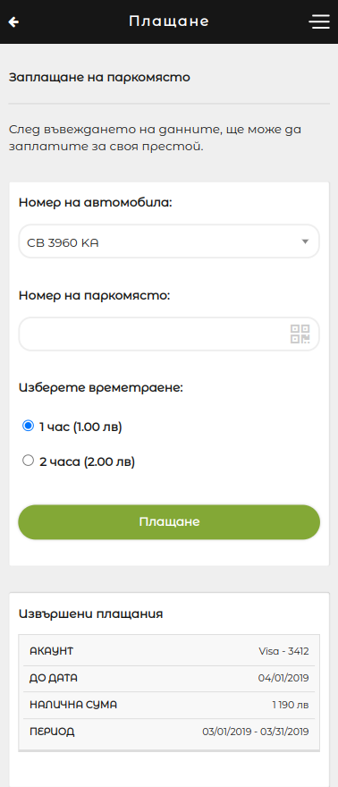
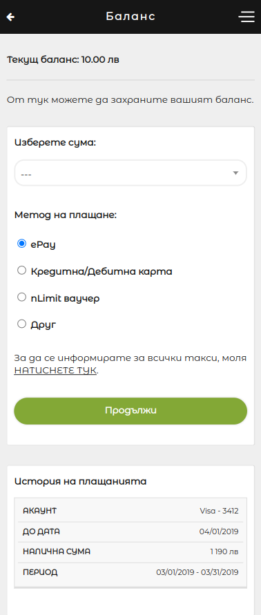
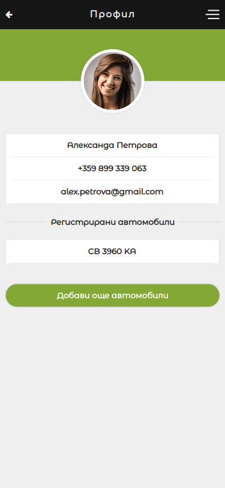
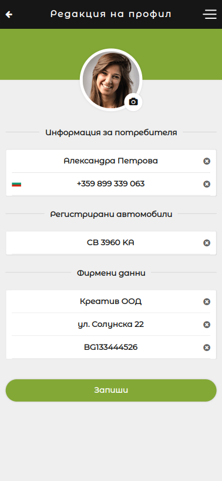
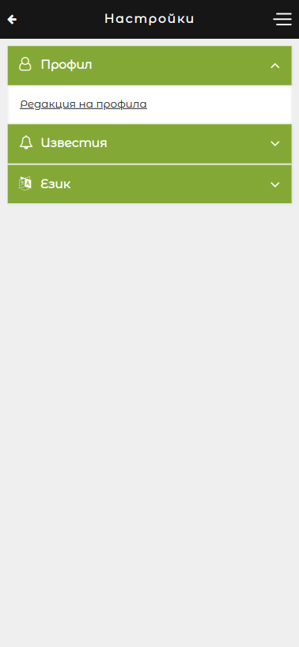
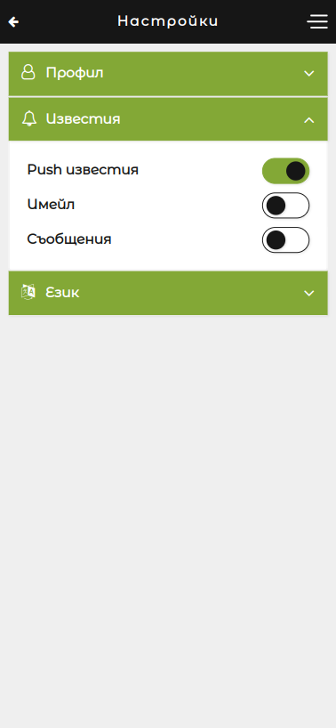
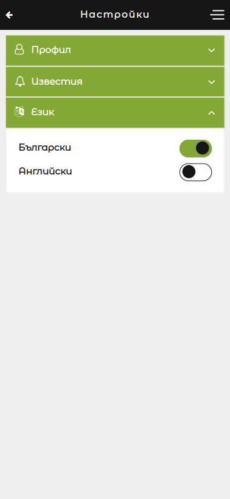
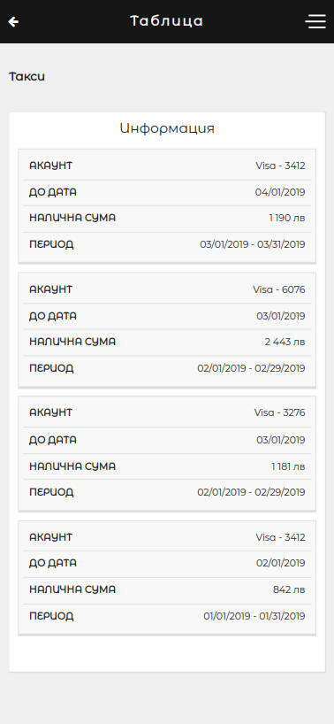
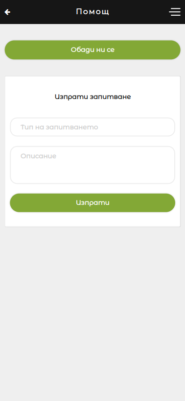

---

## License

This project is licensed under the MIT License.